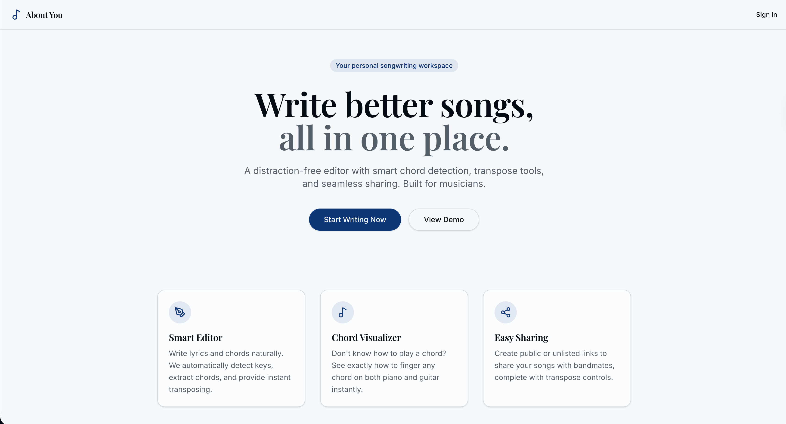

# About You - Songwriting Workspace 🎵



**About You** is a minimal, distraction-free songwriting platform designed specifically for musicians, lyricists, and composers. It provides an intuitive interface to draft lyrics, annotate chords, transpose keys on the fly, and visualize chord fingerings for both piano and guitar.

## Features

- **Smart Editor**: Write lyrics and chords seamlessly. The editor automatically detects and highlights valid music chords within your text.
- **Real-time Transposition**: Effortlessly transpose your entire song up or down by half-steps with a single click.
- **Chord Detection & Key signatures**: Analyzes your song progression to detect the overall musical key.
- **Instrument Visualization**: 
  - **Piano**: Interactive keyboard highlighting notes belonging to the selected chord.
  - **Guitar**: Interactive fretboard displaying chord shapes and fingerings.
- **Song Structure Tagging**: Highlight blocks of text to apply formal structure tags (Verse, Chorus, Pre-Chorus, Bridge, Solo, Outro).
- **Easy Sharing**: Generate a Read-Only public link for a song to share with bandmates or collaborators.
- **PDF Exporting**: Export clean, presentation-ready PDFs of your chord sheets to print for live performances.
- **Theme Support**: Beautiful Light and Dark modes.
- **Mobile Responsive**: Fully usable on mobile with off-canvas sidebar drawers and responsive chord viewers.

## Tech Stack

- **Framework**: [React.js](https://reactjs.org/) + [Vite](https://vitejs.dev/)
- **Routing**: [React Router DOM](https://reactrouter.com/)
- **Styling**: [Tailwind CSS](https://tailwindcss.com/) + Custom CSS Keyframes
- **UI Components**: [shadcn/ui](https://ui.shadcn.com/) (Radix UI primitives)
- **Icons**: [Lucide React](https://lucide.dev/)
- **Backend/Database**: [Firebase](https://firebase.google.com/) (Firestore Base, Firebase Authentication)
- **PDF Generation**: `jspdf` & `html2canvas` 

## Getting Started

### Prerequisites

Ensure you have [Node.js](https://nodejs.org/en/) and [Yarn](https://yarnpkg.com/) (or npm/pnpm) installed.

### Installation

1. **Clone the repository:**
   ```bash
   git clone https://github.com/yunkhngn/about-you.git
   cd about-you
   ```

2. **Install dependencies:**
   ```bash
   yarn install
   # or npm install
   ```

3. **Configure Environment Variables:**
   Create a `.env` file in the root directory and add your Firebase configuration credentials:
   ```env
   VITE_FIREBASE_API_KEY=your_api_key
   VITE_FIREBASE_AUTH_DOMAIN=your_project_id.firebaseapp.com
   VITE_FIREBASE_PROJECT_ID=your_project_id
   VITE_FIREBASE_STORAGE_BUCKET=your_project_id.appspot.com
   VITE_FIREBASE_MESSAGING_SENDER_ID=your_sender_id
   VITE_FIREBASE_APP_ID=your_app_id
   VITE_FIREBASE_MEASUREMENT_ID=your_measurement_id
   ```

4. **Run the development server:**
   ```bash
   yarn dev
   # or npm run dev
   ```

5. **Open app in your browser:**
   Navigate to `http://localhost:5173`.

## Authentication Flow
The app requires an account to create and backup songs.
- **Email/Password**: Requires mandatory Email Verification before accessing the dashboard to prevent ghost/bot accounts.
- **Social Login**: Google One-Tap authentication is supported out of the box.

## Contributing

Contributions, issues, and feature requests are welcome!
Feel free to check out the [issues page](https://github.com/yunkhngn/about-you/issues).

## License

This project is licensed under the MIT License.

---
*Created by [@yunkhngn](https://github.com/yunkhngn) - a homeless musician*
